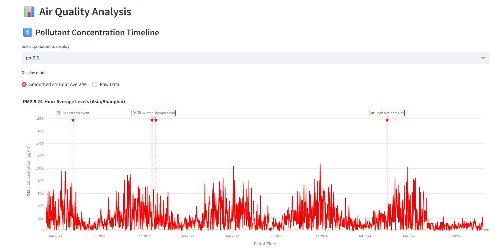

# 🌆 Beijing Air Quality & Weather Analysis Dashboard

An interactive and visually rich **Streamlit dashboard** for analyzing **Beijing’s air quality (2010–2025)** using both **historical CSV data** and **live OpenWeather API data**.



---

## 🧩 Overview

This project provides a comprehensive, interactive tool for exploring pollution trends, air quality indices, and the impact of major events in Beijing over a 15-year period. The dashboard combines **data visualization**, **API integration**, and **statistical analysis** to reveal meaningful insights into the city’s environmental progress.

---

## 🚀 Features

* 📊 **Multi-source integration** – Combine uploaded CSV (2010–2019) with live OpenWeather API data (2020–2025).
* 📈 **Advanced visualizations** – PM2.5 timelines, pollutant correlation matrix, seasonal averages, heatmaps, AQI distributions, and event-driven analysis.
* 🧭 **Timezone conversion** – View data in local or international timezones.
* 🧠 **Event markers** – Annotate the timeline with real-world events such as policy changes, environmental alerts, or global phenomena.
* 📉 **Year-over-year comparison** – Detect long-term air quality improvement or decline.
* 💾 **Exportable results** – Download filtered datasets and summary statistics.

---

## 🧰 Tech Stack

* **Python 3.8+**
* **Streamlit** – frontend and app logic
* **Plotly** – data visualization
* **Pandas & NumPy** – data manipulation
* **Requests** – API communication
* **OpenWeather Air Pollution API** – live air quality data

---

## 📂 Repository Structure

```
beijing-air-quality-dashboard/
├── app.py                # Main Streamlit application
├── requirements.txt      # Dependencies
├── README.md             # Documentation (this file)
├── .gitignore            # Ignored files and folders
├── data/                 # Optional sample datasets
│   └── beijing_2010_2019_sample.csv
├── assets/               # Screenshots or preview images
└── LICENSE               # MIT license
```

---

## ⚡ Quick Start (Local Setup)

1. Clone the repository:

   ```bash
   git clone https://github.com/<your-username>/beijing-air-quality-dashboard.git
   cd beijing-air-quality-dashboard
   ```

2. Install dependencies:

   ```bash
   pip install -r requirements.txt
   ```

3. Run the Streamlit app:

   ```bash
   streamlit run app.py
   ```

4. Visit **[http://localhost:8501](http://localhost:8501)** to view your dashboard.

---

## ☁️ Deployment (Streamlit Cloud)

1. Push your repository to **GitHub**.
2. Go to [https://share.streamlit.io](https://share.streamlit.io).
3. Click **New app** → Select your repo and `app.py`.
4. Click **Deploy** 🚀.

Your app will be live at:

```
https://<your-username>-beijing-air-quality-dashboard.streamlit.app
```

---

## 🔐 API Configuration

To fetch live air quality data:

1. Create an account at [OpenWeather](https://openweathermap.org/api).
2. Generate a **free API key**.
3. Enter it in the app sidebar under “🔌 API Configuration”.

> ⚠️ Never commit your API key directly to the repository. Use Streamlit’s secret manager or environment variables.

---

## 📊 Example Visualizations

* **PM2.5 Concentration Timeline** – with major event annotations
* **Pollutant Correlation Heatmap** – relationships among PM2.5, NO₂, O₃, etc.
* **Seasonal Averages & Heatmaps** – pollution trends by month or day of week
* **Year-over-Year Comparison** – progress tracking from 2010 to 2025

---

## 🧾 Credits

Developed by **Arhaan Arora**
**B.S. Computer Science | Roll No. 2510110957**
Shiv Nadar University

---

## 📜 License

This project is licensed under the [MIT License](LICENSE).

---

### ⭐ Support

If you like this project, give it a star ⭐ on GitHub and share it with your peers!

For issues or suggestions, feel free to open a [GitHub issue](../../issues).
